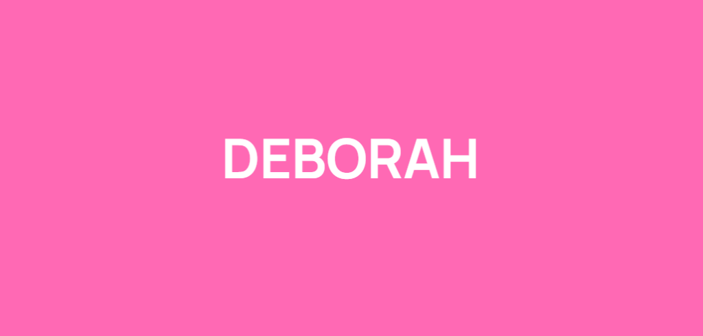

# DEBORAH System Overview & Basic Design

[日本語版](#deborah-システム-基本設計概要資料-japanese-version)

## 1. Introduction

DEBORAH is fundamentally a "novel creation tool". It is designed to comprehensively support the entire process of writing a novel using the power of AI, from building the world setting and characters to the actual writing of the story, as well as providing assistance and consultation during the writing process.

## 2. Architecture

The DEBORAH system is composed of two major functional blocks: **MOMMY** and **WOMB**.

### 2.1. MOMMY (World & Entity Management)

MOMMY is a tool for creating and managing the foundational information that forms the base of the story's world. It creates and systematically manages three types of "Entities":

- **Fuckmeat (Mommy)**
- **Penis (Nerd)**
- **Lore**

These function as the foundational data components for character profiles (attributes/traits), world-building, and terminology.

### 2.2. WOMB (Story Creation & Writing Support)

WOMB is the main tool used to actually create and write the story. It builds the narrative based on the Entity information received from MOMMY. Functionally, WOMB is further divided into two core components: **WOMB** and **CORD**.

- **WOMB**: The core function that actually generates the text of the story.
- **CORD**: An assistant function that helps with research for the story and acts as a consultant for settings and plot development.

---

## 3. The Core Feature: Advanced Integration of WOMB and CORD

While the concept of creating and managing prerequisite knowledge is common in other AI-assisted writing tools, **one of DEBORAH's absolute defining features is the tight integration between WOMB and CORD**.

### 3.1. Dynamic Tracking via History Function

DEBORAH features a "History" function that records changes and milestones that occur to Entities within each story. **CORD automatically generates and updates this history** as the story progresses.

### 3.2. Context Optimization by CORD

In typical AI writing applications, registered information (like Entities) is simply passed to the generative AI in response to predefined keywords. In DEBORAH, CORD performs a much more sophisticated intermediary step:

1. **Information Culling**: CORD interprets the current situation of the story and selectively filters the information that needs to be passed to WOMB.
2. **Synthesis and Editing**: It synthesizes the selected information with other relevant context, **compiling it into the most appropriate format for WOMB to accurately depict the scene**.

By acting as a "brilliant editor and assistant" that bridges this information gap, CORD enables WOMB to generate highly accurate and contextually rich descriptions.

---

## 4. Recently Implemented Integrated Features

The core vision of tight integration between WOMB and CORD has been successfully realized, bringing advanced AI collaboration to the writing process:

- **Automatic History Extraction by CORD**: CORD runs in the background to analyze the latest story developments written by WOMB. It automatically detects new events and updates the history logs for active entities, ensuring the Lorebook stays perfectly synchronized with the narrative without manual user effort.
- **Narrative Blueprint Generation**: Before WOMB writes the next continuation, CORD can be invoked to analyze the current scene and generate a "Narrative Blueprint." This blueprint provides high-level directions, emotional arcs, and structural goals (Must-haves) to guide WOMB, acting as an active director for the generative process.
- **Dynamic Context Injection**: CORD selectively packages the story body, matched entity definitions, and relevant recent history logs into optimized prompts. This structured data is fed directly into WOMB or CORD's own processing pipeline with precise length and stylistic constraints, ensuring highly accurate context-awareness.

---

## 5. Long-Term Vision & Roadmap

The ultimate goal for DEBORAH is to evolve beyond a text-based novel creation tool and become a comprehensive **Video Game Creation Studio** (or function as an interactive video game itself). Future major expansions will integrate various generative AI models directly into the creative pipeline:

- **AI Image Generation**: Automatically generating character portraits, background CGs, and item illustrations based on Entity data and story context.
- **AI Video Generation**: Creating dynamic cutscenes and animated sequences to bring the story to life.
- **3D Model Generation**: Generating 3D assets to build fully realized, interactive worlds.

 

 

# DEBORAH システム 基本設計・概要資料 (Japanese Version)

## 1. アプリケーション概要

DEBORAHは、大まかにいえば「ノベル作成ツール」です。世界観やキャラクターの構築から実際の物語の執筆、さらには執筆時の設定相談やサポートまで、小説執筆における一連のプロセスをAIの力で総合的に支援するシステムとして設計されています。

## 2. システム構成

DEBORAHシステムは大きく分けて「**MOMMY**」と「**WOMB**」という2つの主要機能ブロックで構成されています。

### 2.1. MOMMY (世界観・エンティティ作成管理機能)

MOMMYは物語の世界観のベースとなる情報を作成し、管理するためのツールです。MOMMYは以下の3種類の「Entity（エンティティ）」を作成し、体系的に管理します。

- **Fuckmeat (Mommy)**
- **Penis (Nerd)**
- **Lore**

これらはキャラクター設定（属性・特性）や世界観・用語解説などの基盤となるデータ構成要素として機能します。

### 2.2. WOMB (物語作成・執筆支援機能)

実際に物語を作成・執筆するためのメインツールです。MOMMYから受け取ったEntityの情報をベースにして物語を構築します。機能の役割として、WOMBは内部でさらに**「WOMB」**本機能と**「CORD」**に分かれています。

- **WOMB**: 物語の本文を実際に作成するコア機能。
- **CORD**: 物語を作るための調べ物を助けたり、設定や展開についての相談相手となる機能。

---

## 3. DEBORAHの最大の特徴：「WOMB」と「CORD」の高度な連携

前提知識を事前に作成し管理する機能自体は、他のAIを活用した文書作成ツールにも見られるアプローチですが、**DEBORAHの最大の特徴の一つは「WOMB」と「CORD」の密接な連携**にあります。

### 3.1. ヒストリー機能による動的な変化の記録

各ストーリー内でEntityに起きた変化や状態を記録していく「ヒストリー」機能を備えています。物語の進行に合わせて、**CORDが自動的にこのヒストリーを作成・更新します**。

### 3.2. CORDによるコンテキストの最適化

一般的なAI文書アプリケーションでは、設定されたキーワードに反応して単純に登録された情報（Entity）を生成AIに渡すアプローチが主流です。一方DEBORAHでは、CORDが一段階高度な処理を挟みます。

1. **情報選別**: CORDが現在の物語の状況に合わせて、WOMBに渡す情報をさらに取捨選択・選別します。
2. **情報の総合と編集**: 選別した情報を他の関連するコンテキストと総合し、**WOMBが状況を描写するために最も適した情報としてまとめてから渡す**役割を担います。

このように、CORDが「優秀な編集者・アシスタント」として情報の橋渡しを行うことで、WOMBはより高い精度で文脈に沿った豊かな描写を行うことが可能になります。

---

## 4. 最近実装された連携機能

WOMBとCORDの密接な連携という核心的なビジョンが実現され、執筆プロセスにおいて高度なAIの協調動作が可能になりました。

- **CORDによるヒストリーの自動抽出**: WOMBによって新しく執筆された物語の展開をCORDがバックグラウンドで分析します。登場人物に関する新しい出来事を自動的に検知してヒストリーログを更新し、手動操作なしでLorebookと物語の進行を常に同期させます。
- **Narrative Blueprint（展開指示書）の生成**: WOMBに続きを書かせる直前にCORDを介入させ、現在のシーンを分析して「Narrative Blueprint」を生成させることができます。これには次の展開の目標（Must-have）、感情の動き、構成の指示が含まれ、WOMBの生成プロセスを導く優秀な監督として機能します。
- **動的なコンテキスト注入**: CORDは、物語本文、マッチしたキャラクター設定、および関連する最新のヒストリーログを選択的にパッケージ化して最適化されたプロンプトを作成します。この構造化されたデータは、厳密な文字数や書式制約とともにWOMBやCORD自身の処理プロセスへ直接供給され、極めて精度の高い文脈認識を実現しています。

---

## 5. 長期的な展望とロードマップ

DEBORAHの最終的な野望は、単なるテキストベースの「ノベル作成ツール」の枠を超え、それ自体が**ある種のビデオゲーム**、あるいは**ビデオゲームの総合制作環境**へと進化することです。
今後の長期的な展開として、テキスト生成に留まらず、様々な生成AIモデルをシステムに統合していく予定です。

- **AIによる画像生成**: Entityのデータや物語の状況（コンテキスト）に基づいた、キャラクターの立ち絵・背景CG・スチルイラストなどの自動生成機能。
- **AIによる動画生成**: 動的なカットシーンやイベントアニメーションの生成機能。
- **3Dモデル生成**: 構築した世界観を完全にインタラクティブなゲームへと昇華させるための3Dアセットの生成機能。
